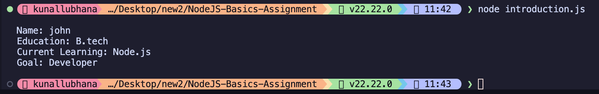
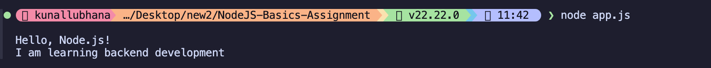

# NodeJS-Basics-Assignment

## Assignment description
This assignment helps in understanding how to create and execute a basic Node.js application and use JavaScript to display output in the terminal.

### Task 1: Your First Node.js Program
Create a Node.js application that prints messages in the terminal.

### Task 2: Create a Simple Introduction Program
Create a Node.js program that displays personal introduction.

## Steps to run the programs
1. Make sure Node.js is installed on your computer.
2. Open the terminal and navigate to the `NodeJS-Basics-Assignment` folder.
3. Run the commands mentioned below for the respective files.

## Commands used
- To run Task 1:
  ```bash
  node app.js
  ```
- To run Task 2:
  ```bash
  node introduction.js
  ```

## Output screenshots
*(Please replace these placeholders with actual screenshots of your terminal output)*

**Task 1 Output Screenshot:**


**Task 2 Output Screenshot:**

