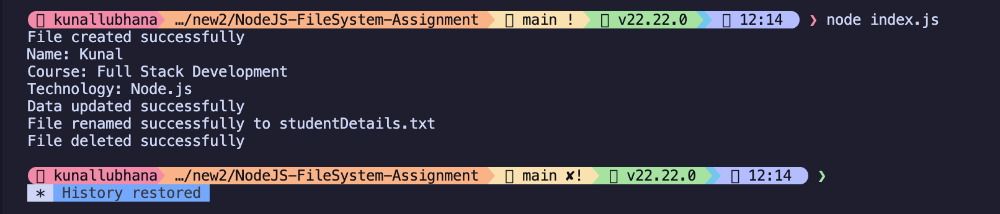

# NodeJS-FileSystem-Assignment

## Assignment explanation
This assignment demonstrates the use of the `fs` module in Node.js to perform basic file system operations. It includes creating a file, reading data from it, appending new data, renaming the file, and finally deleting it.

## How to run the program
1. Make sure Node.js is installed on your computer.
2. Open the terminal and navigate to the `NodeJS-FileSystem-Assignment` folder.
3. Run the following command:
   ```bash
   node index.js
   ```

## Output screenshots
*(Please replace the placeholder below with the actual screenshot of your terminal output)*

**Execution Output Screenshot:**

