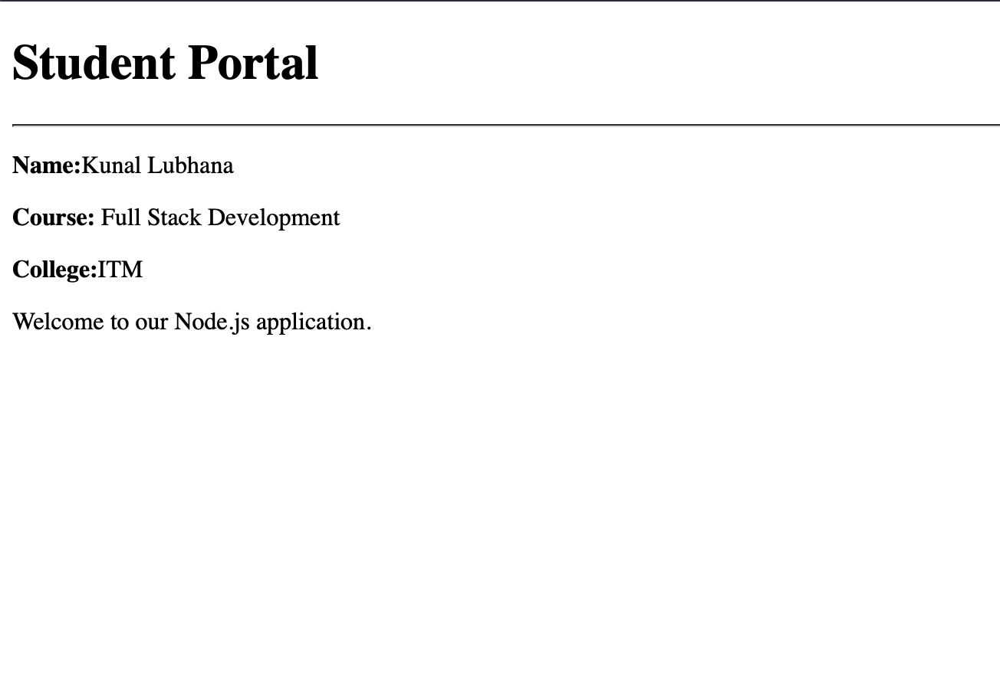
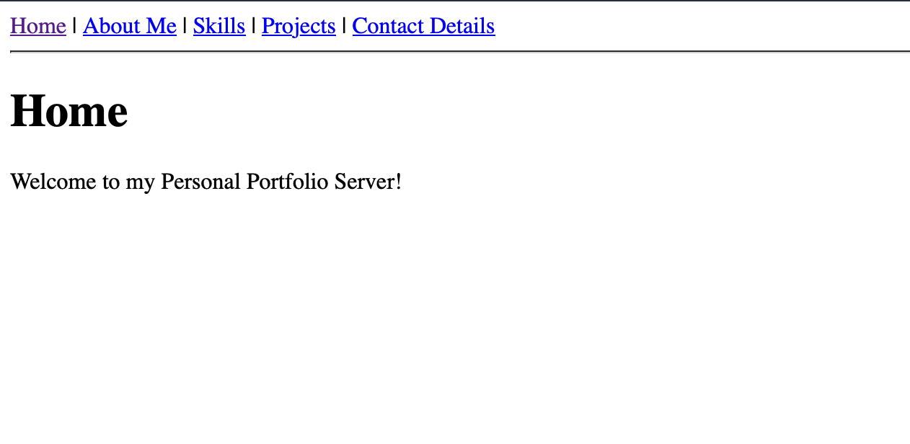

# Node.js HTTP Server Assignments

This repository contains 5 assignments focused on creating Node.js HTTP servers using the built-in `http` module.

## Assignment 1: Basic HTTP Server (10 Marks)
**Objective:** Create a basic HTTP server using Node.js that displays a welcome message in the browser.

**Problem Statement:**
Develop a Node.js application that:
- Creates an HTTP server using the built-in `http` module.
- Runs the server on Port 3000.
- Displays the message "Welcome to Node.js Server" in the browser.
- Logs the message "Server is running on http://localhost:3000" in the terminal when the server starts.

**Expected Output:**

## Assignment 2: HTML Response Server (10 Marks)
**Objective:** Serve an HTML page using the Node.js HTTP module.

**Problem Statement:**
Create a Node.js server that returns an HTML page containing:
- A heading: Student Portal
- Student Name
- Course Name
- College Name
- A welcome paragraph

**Expected Output:**

## Assignment 3: Student JSON API (10 Marks)
**Objective:** Create a simple REST-like endpoint that returns JSON data.

**Problem Statement:**
Create a Node.js server with the following behavior:
- When the user visits `/student`, return a JSON object with student details (id, name, course, semester, city).
- If the user visits any other route, display: `404 - Page Not Found`

**Expected Output:**

## Assignment 4: Route Handling Server (10 Marks)
**Objective:** Implement multiple routes using the Node.js HTTP module.

**Problem Statement:**
Create a server with the following routes:
- `/` -> Welcome to Home Page
- `/about` -> About Us
- `/contact` -> Contact Information
- `/services` -> Our Services
- Any other route -> 404 - Page Not Found

**Expected Output:**

## Assignment 5: Personal Portfolio Server (10 Marks)
**Objective:** Create a simple portfolio website using only the Node.js HTTP module.

**Problem Statement:**
Develop a Node.js server with the following routes (`/`, `/about`, `/skills`, `/projects`, `/contact`). 
- Each route should return an HTML page with appropriate heading and relevant content.
- Include navigation links to move between pages.
- Handle invalid routes by displaying 404 - Page Not Found.

**Expected Output:**

## Common Rubric (Applicable to All Assignments)
- Implementation & Functionality: 3 Marks
- Routing & Response Handling: 2 Marks
- Output Accuracy: 2 Marks
- Code Quality & Readability: 2 Marks
- Execution: 1 Mark
- Total: 10 Marks
